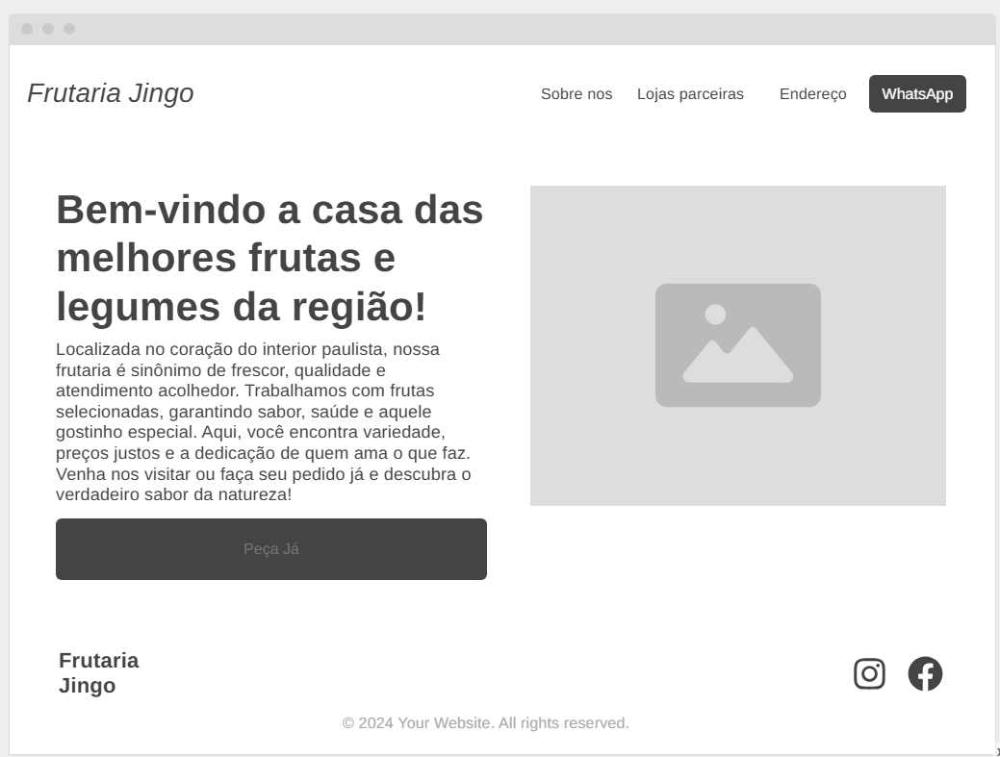

# 📘 Proposta do Projeto 1

Este documento serve como guia para estruturar e documentar a proposta do projeto extensionista.  
Preencha cada seção de forma clara e objetiva, utilizando textos, imagens e exemplos práticos quando necessário.

---

## 💡 Processo de Ideação
<!-- Explique como surgiu a ideia do projeto, quais problemas ou oportunidades foram identificados e como o grupo chegou à proposta atual -->  
"A ideia surgiu a partir da observação de dificuldades perante a competitividade com supermercados da região que possuem uma forma rapida e sucinta de realizar pedidos online, assim diminuindo a busca pela frutaria."

---

## 📌 Título do Projeto
<!-- Insira aqui o título do projeto extensionista -->
"Site Frutaria Jingo"

---

## 👥 Integrantes do Grupo
<!-- Liste todos os integrantes do grupo com nome completo e RA -->
- João Konomi (10439153)

---

## 📝 Proposta Sintetizada do Projeto
<!-- Descreva em poucas linhas a ideia central do projeto, destacando os objetivos e o impacto esperado -->
"A proposta do projeto é apliar o alcance e estimular a venda da frutaria por meio web."

---

## 🖼️ Protótipo Inicial
<!-- Inclua imagens ou links das telas, fluxos ou mockups do protótipo inicial -->

---

## 🌍 Caráter Extensionista
<!-- Explique como o projeto contribui para a comunidade externa e qual é a sua relevância social -->
 
"O projeto busca ajudar um pequeno comercio familiar no interior de São Paulo a expandir seus possiveis clientes com ajuda da tecnologia e facilidade de acesso a um site oficial."

---

## 🤝 Colaborador Externo
<!-- Indique quem é a pessoa ou organização parceira que colabora com o projeto nas ações extensionistas -->
- Organização: Frutaria Jingo  
- Representante: Marcos Akira Konomi (Responsavel por compra e venda de mercadoria e dono)
- Representante: Isabel Yoshime Konomi(Dona da loja) 
- Representante: Marcia Akemi Konomi (Administradora e dona)

---

## 💻 Explicação do Código (Tutorial)
<!-- Documente o funcionamento do código desenvolvido, passo a passo, como em um tutorial -->
Explique sobre o desenvolvimento técnico do projeto dentro das solicitações da proposta
